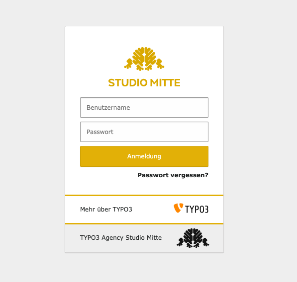

# TYPO3 Extension `be_login_template`

This extension makes it possible to customize the look and file of the TYPO3 Backend. This makes it easy to add additional links to e.g. your agency.

## Requirements:

- TYPO3 11.5 LTS

## Usage

1. Install the extension by either using `composer require studiomitte/be-login-template` or by downloading the extension from the Extension Manager or TER.
2. Copy the directory from `EXT:be_login_template/Resources/Private/Styling` to your site package and change it to your needs.
3. Adopt the path in the extension settings in the Install Tool.
4. You are done!

## About

This extension has been brought to you by [StudioMitte](https://studiomitte.com).

